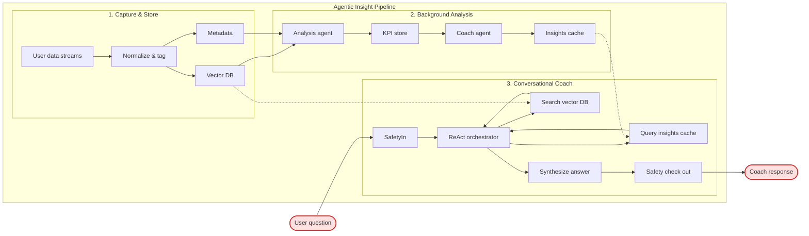
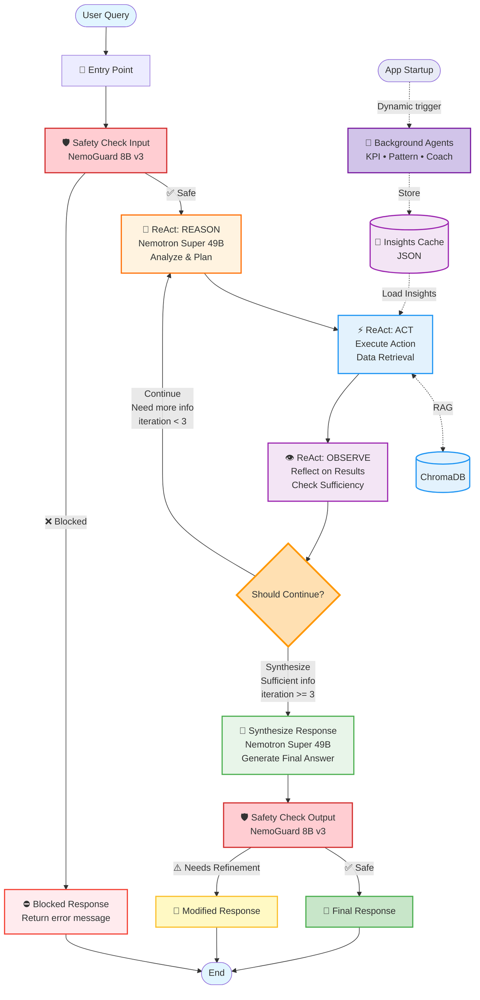

# Agentic Wellness Lifelog · Personal AI Coach

[](https://www.nvidia.com/gtc/)
[](https://www.nvidia.com/en-us/ai/)


- **Mission** – Deliver a privacy-first personal intelligence layer that converts quantified-self data into actionable coaching, as framed in `docs/project-outline.md`.
- **Problem** – Individuals drown in siloed sleep, mood, and productivity logs that lack synthesis; the platform unifies them into a trusted narrative.
- **Solution** – LangGraph orchestrates Nemotron agents (reasoning, safety, retrieval) running on NVIDIA NIM, mirroring the data and control paths in `docs/project-diagram.md`.
- **Safety & Privacy** – Dual Nemotron Safety Guard checkpoints moderate every input/output and keep sensitive data local-first with encrypted storage.
- **Nemotron & NIM Alignment** – Showcases Super 49B for reasoning, Nano 9B for fast tool use, and Guard 8B for policy enforcement, highlighting NVIDIA GTC Nemotron track goals.
- **Current Status** – React+FastAPI UI with streaming, ChromaDB vector store with NVIDIA embeddings, multi-agent ReAct loop, and background insight generation are production-ready.
- **Resources** – Architecture blueprint and latest diagrams live in `docs/project-outline.md` and `docs/project-diagram.md`.

## Architecture Diagram


## User Query Workflow



## Multi-Agent Architecture

### Background Agents
The system employs multiple specialized Nemotron agents working in concert:

**🧠 Reasoning Agent (Nemotron Super 49B)**
- Handles complex reasoning and synthesis
- Orchestrates the ReAct (Reasoning + Action) loop
- Generates comprehensive insights from data patterns

**⚡ Tool Agent (Nemotron Nano 9B)**
- Fast execution for tool calls and data retrieval
- Manages vector database queries
- Handles real-time data processing

**🛡️ Safety Agent (Nemotron Guard 8B)**
- Dual checkpoint system for input/output moderation
- Enforces privacy and content policies
- Ensures safe, appropriate responses

**📊 Analysis Agent**
- Continuously processes incoming lifelog data
- Identifies trends and correlations in background
- Updates KPI store with computed metrics

**💡 Coach Agent**
- Synthesizes insights from multiple data sources
- Generates personalized recommendations
- Maintains context across conversations

### Agent Orchestration
- **LangGraph** coordinates agent interactions with state management
- **Streaming Architecture** enables real-time response generation
- **Safety Checkpoints** at entry and exit ensure content compliance
- **Background Processing** runs continuously to pre-compute insights

### How Background Agents Work
1. **Data Ingestion**: Lifelog data (sleep, mood, exercise) is normalized and stored in ChromaDB with NVIDIA embeddings
2. **Continuous Analysis**: Background agents analyze patterns without user queries:
   - Sleep quality trends over time
   - Mood-exercise correlations
   - Productivity patterns by time of day
3. **Pre-computed Insights**: Results are cached for instant retrieval during conversations
4. **ReAct Loop**: When users ask questions, the orchestrator:
   - Retrieves relevant data from vector store
   - Queries pre-computed insights
   - Synthesizes personalized response
   - Applies safety checks before delivery

### Agent Communication Flow
```
User Query → Safety Check → ReAct Orchestrator
                                ↓
                    [Parallel Tool Execution]
                    ├── Vector DB Search
                    ├── Insights Cache Query
                    └── Real-time Analysis
                                ↓
                    Synthesis & Reasoning
                                ↓
                    Safety Check → User Response
```

### Why Nemotron for Wellness Coaching

**Nemotron Advantages:**
- **Super 49B**: Superior reasoning for complex health pattern analysis and nuanced coaching advice
- **Nano 9B**: Lightning-fast tool use enables real-time data retrieval without latency
- **Guard 8B**: Medical-grade safety ensures no harmful health advice or privacy violations
- **NVIDIA Embeddings**: High-quality semantic search for finding relevant lifelog patterns
- **NIM Infrastructure**: Enterprise-ready deployment with guaranteed performance

**Privacy-First Design:**
- All processing via NVIDIA NIM APIs (no local model storage)
- Sensitive data remains in local ChromaDB
- Safety checks prevent PII leakage
- Encrypted vector embeddings

## Get Started

### Prerequisites
1. Clone this repo.
2. Install Python dependencies: `uv sync`
3. Configure credentials: `cp env.example .env` and add `NVIDIA_API_KEY`.
4. Install frontend dependencies:
```bash
cd frontend
npm install
cd ..
```

### Running the Application

#### Option 1: React + FastAPI (Recommended)
The application consists of two parts that need to run simultaneously:

**Terminal 1 - Start the Backend Server:**
```bash
# From project root
uv run python backend/main.py
# Backend will run on http://localhost:8000
```

**Terminal 2 - Start the Frontend:**
```bash
# From project root
cd frontend
npm run dev
# Frontend will run on http://localhost:5173
```

Then open your browser to **http://localhost:5173**

**Features:**
- 🚀 Real-time streaming responses via HTTP SSE
- 🎨 Modern React UI with Tailwind CSS
- 📊 Interactive data visualizations
- 🤖 Multi-agent orchestration visibility
- 🛡️ Safety checks displayed in UI

#### Option 2: Streamlit (Legacy)
```bash
# Simple all-in-one interface
uv run streamlit run app.py
# Opens on http://localhost:8501
```

**Features:**
- 📝 Simple single-file application
- 🔄 Basic chat interface
- 📈 Quick prototyping

### API Documentation
When running the FastAPI backend, you can access:
- **API Docs:** http://localhost:8000/docs
- **Health Check:** http://localhost:8000/health
- **API Info:** http://localhost:8000/

## Troubleshooting

### Common Issues
- **Port already in use:** Change ports in `backend/main.py` (default: 8000) or `frontend/vite.config.ts` (default: 5173)
- **CORS errors:** Ensure both frontend and backend are running
- **Missing NVIDIA_API_KEY:** Check your `.env` file has the correct API key
- **Database errors:** Clean and reinitialize with `rm -rf chroma_db && uv run python src/data_store.py`

## Notes
- To clean old data: run `rm -rf chroma_db`.
- Sample lifelog data sits in `data/sample_lifelog.csv` for quick experimentation.
- Update `.env` before connecting to live NVIDIA NIM endpoints.
- See `uv.lock` to mirror the locked dependency set.
