# LangGraph Agent Workflow Diagram

## Overview
This diagram shows the detailed flow of the LangGraph agent implementation with ReAct pattern and safety guardrails.

## Main Workflow Diagram

```mermaid
graph TD
    Start([User Query]) --> Entry[🚀 Entry Point]
    Entry --> SafetyIn[🛡️ Safety Check Input<br/>NemoGuard 8B v3]
    
    %% Background Agents (run at startup)
    AppStart([App Startup]) -.->|One-time| BgAgents[🔄 Background Agents<br/>KPI • Pattern • Coach]
    BgAgents -.->|Store| Cache[(💾 Insights Cache<br/>JSON)]
    
    %% Safety check branches
    SafetyIn -->|✅ Safe| ReActReason
    SafetyIn -->|❌ Blocked| BlockedResponse[⛔ Blocked Response<br/>Return error message]
    BlockedResponse --> End([End])
    
    %% ReAct Loop
    ReActReason[🧠 ReAct: REASON<br/>Nemotron Super 49B<br/>Analyze & Plan] --> ReActAct[⚡ ReAct: ACT<br/>Execute Action<br/>Data Retrieval]
    
    %% ACT node now retrieves both data and cached insights
    ReActAct <-.->|RAG| VectorDB[(ChromaDB)]
    Cache -.->|Load Insights| ReActAct
    
    ReActAct --> ReActObserve[👁️ ReAct: OBSERVE<br/>Reflect on Results<br/>Check Sufficiency]
    
    %% Conditional routing
    ReActObserve --> Decision{Should Continue?}
    Decision -->|Continue<br/>Need more info<br/>iteration < 3| ReActReason
    Decision -->|Synthesize<br/>Sufficient info<br/>iteration >= 3| Synthesize[🎨 Synthesize Response<br/>Nemotron Super 49B<br/>Generate Final Answer]
    
    %% Output safety check
    Synthesize --> SafetyOut[🛡️ Safety Check Output<br/>NemoGuard 8B v3]
    SafetyOut -->|✅ Safe| FinalResponse[💬 Final Response]
    SafetyOut -->|⚠️ Needs Refinement| ModifiedResponse[📝 Modified Response]
    
    FinalResponse --> End
    ModifiedResponse --> End
    
    %% Styling
    style Start fill:#e1f5ff
    style End fill:#e1f5ff
    style AppStart fill:#e8eaf6
    style BgAgents fill:#d1c4e9,stroke:#7b1fa2,stroke-width:2px
    style Cache fill:#f3e5f5,stroke:#9c27b0,stroke-width:2px
    style VectorDB fill:#e3f2fd,stroke:#2196f3,stroke-width:2px
    style SafetyIn fill:#ffcdd2,stroke:#d32f2f,stroke-width:2px
    style SafetyOut fill:#ffcdd2,stroke:#d32f2f,stroke-width:2px
    style ReActReason fill:#fff3e0,stroke:#ff6f00,stroke-width:2px
    style ReActAct fill:#e3f2fd,stroke:#2196f3,stroke-width:2px
    style ReActObserve fill:#f3e5f5,stroke:#9c27b0,stroke-width:2px
    style Decision fill:#ffe0b2,stroke:#ff9800,stroke-width:3px
    style Synthesize fill:#e8f5e9,stroke:#4caf50,stroke-width:2px
    style BlockedResponse fill:#ffebee,stroke:#f44336,stroke-width:2px
    style FinalResponse fill:#c8e6c9,stroke:#4caf50,stroke-width:2px
    style ModifiedResponse fill:#fff9c4,stroke:#fbc02d,stroke-width:2px
```



## Node Details

### 1. **Safety Check Input** (`safety_check_input_node`)
- **Purpose**: Validate user input for safety concerns
- **Model**: Nemotron Safety Guard 8B v3
- **Actions**:
  - Check for self-harm indicators
  - Detect requests for medical/financial advice
  - Identify privacy violations
  - Block inappropriate content
- **Output**: Either continues to ReAct loop or blocks with error

### 2. **ReAct: REASON** (`react_reason_node`)
- **Purpose**: Analyze query and plan next action
- **Model**: Nemotron Super 49B v1.5
- **Actions**:
  - Analyze problem context
  - Review previous observations (if any)
  - Determine what information is needed
  - Plan next action (data_retrieval, analysis, etc.)
- **Output**: Reasoning and action plan

### 3. **ReAct: ACT** (`react_act_node`)
- **Purpose**: Execute the planned action
- **Actions**:
  - Retrieve data from vector store (ChromaDB)
  - Query lifelog entries (default 5 results)
  - **NEW**: Load pre-computed insights from cache
  - Could extend to other tools (web search, KPI queries, etc.)
- **Output**: Retrieved data, cached insights, and action results

### 4. **ReAct: OBSERVE** (`react_observe_node`)
- **Purpose**: Reflect on action results and decide next steps
- **Model**: Nemotron Super 49B v1.5
- **Actions**:
  - Evaluate if retrieved data is sufficient
  - Add observations to context
  - Increment iteration counter
  - Determine whether to continue or synthesize
- **Decision Logic**:
  - Continue if: iteration < max_iterations (3) AND not sufficient info
  - Synthesize if: iteration >= 3 OR sufficient info gathered

### 5. **Synthesize Response** (`synthesize_response_node`)
- **Purpose**: Generate final answer from all gathered information
- **Model**: Nemotron Super 49B v1.5 (ReasoningAgent)
- **Actions**:
  - Analyze all retrieved data
  - Identify patterns and correlations
  - Generate actionable insights
  - Create personalized recommendations
- **Output**: Complete response with insights

### 6. **Safety Check Output** (`safety_check_output_node`)
- **Purpose**: Validate AI-generated response
- **Model**: Nemotron Safety Guard 8B v3
- **Actions**:
  - Check for medical diagnoses
  - Detect financial advice
  - Identify harmful recommendations
  - Ensure no privacy violations
- **Output**: Safe response or modified/blocked content

## State Management

The workflow maintains an `AgentState` throughout execution:

```python
class AgentState(TypedDict):
    query: str                  # User's original query
    query_analysis: dict         # Query analysis results
    retrieved_data: list        # Data from vector store
    response: str               # Final response
    reasoning_steps: list       # Trace of all reasoning steps
    safety_checks: list         # Log of safety validations
    react_context: dict         # ReAct loop context
    observations: list          # Accumulated observations
    iteration_count: int        # Current iteration number
    should_continue: bool       # Continue flag for loop
```

## Key Features

### 1. **ReAct Pattern Implementation**
- Iterative reasoning-action-observation cycles
- Maximum 3 iterations to prevent infinite loops
- Dynamic decision-making based on observations

### 2. **Safety Guardrails**
- Dual safety checks (input and output)
- Blocks harmful content
- Protects against medical/financial advice
- Privacy protection

### 3. **Streaming Support**
- Real-time updates to UI
- Intermediate step visibility
- Progress tracking through reasoning steps

### 4. **Error Handling**
- Graceful failure with error messages
- Safety-first approach (fail closed)
- Comprehensive logging

## Configuration

- **Max Iterations**: 3 (configurable)
- **Default Data Retrieval**: 5 entries
- **Models Used**:
  - Nemotron Super 49B v1.5 (reasoning, ReAct, synthesis)
  - Nemotron Safety Guard 8B v3 (safety checks)
  - Nemotron Nano 9B v2 (query analysis - available but not in main flow)

## Extension Points

The workflow is designed to be extensible:
1. Add more action types in `react_act_node`
2. Integrate additional tools (web search, KPI queries, etc.)
3. Customize safety policies
4. Adjust iteration limits
5. Add more sophisticated observation logic

## Background Agents Integration (NEW)

The workflow now includes pre-computed insights from background agents that run at startup:

### Background Analysis Components:
1. **KPI Agent** - Calculates metrics like sleep quality, mood averages, productivity scores
2. **Pattern Agent** - Detects correlations (e.g., sleep → mood patterns)
3. **Coach Agent** - Generates proactive recommendations

### Integration Points:
- **App Startup**: Background agents run once when app initializes
- **ReAct ACT Node**: Retrieves relevant cached insights based on query
- **Synthesis Node**: Incorporates both real-time data and cached insights

### Benefits:
- Reduced latency (pre-computed insights available instantly)
- Richer context for responses
- Proactive coaching recommendations
- Pattern detection across historical data
