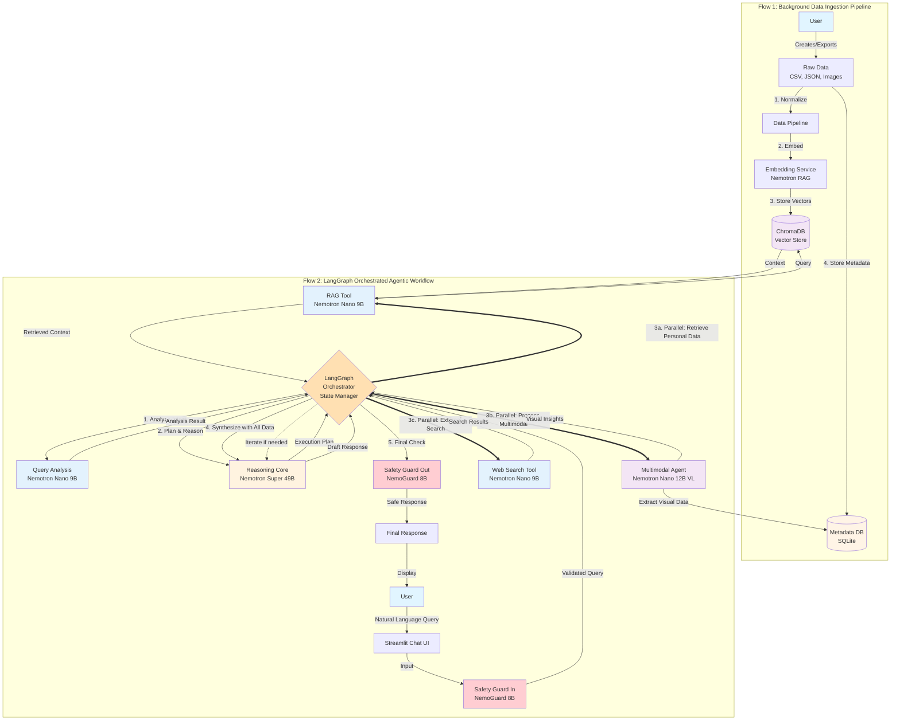

```mermaid
graph TB
    subgraph "Flow 1: Background Data Ingestion Pipeline"
        U1[User] -->|Creates/Exports| RawData[Raw Data<br/>CSV, JSON, Images]
        RawData -->|1. Normalize| Pipeline[Data Pipeline]
        Pipeline -->|2. Embed| Embedder[Embedding Service<br/>Nemotron RAG]
        Embedder -->|3. Store Vectors| VectorDB[(ChromaDB<br/>Vector Store)]
        RawData -->|4. Store Metadata| Metadata[(Metadata DB<br/>SQLite)]
    end

    subgraph "Flow 2: LangGraph Orchestrated Agentic Workflow"
        U2[User] -->|Natural Language Query| Chat[Streamlit Chat UI]
        Chat -->|Input| SafetyIn[Safety Guard In<br/>NemoGuard 8B]
        SafetyIn -->|Validated Query| Orch{LangGraph<br/>Orchestrator<br/>State Manager}
        
        Orch -->|1. Analyze Intent| QueryAgent[Query Analysis<br/>Nemotron Nano 9B]
        QueryAgent -->|Analysis Result| Orch
        
        Orch -->|2. Plan & Reason| ReasonAgent[Reasoning Core<br/>Nemotron Super 49B]
        ReasonAgent -->|Execution Plan| Orch
        
        Orch ==>|3a. Parallel: Retrieve Personal Data| RAGTool[RAG Tool<br/>Nemotron Nano 9B]
        RAGTool -->|Query| VectorDB
        VectorDB -->|Context| RAGTool
        RAGTool -->|Retrieved Context| Orch
        
        Orch ==>|3b. Parallel: Process Multimodal| MMAgent[Multimodal Agent<br/>Nemotron Nano 12B VL]
        MMAgent -->|Extract Visual Data| Metadata
        MMAgent -->|Visual Insights| Orch
        
        Orch ==>|3c. Parallel: External Search| WebTool[Web Search Tool<br/>Nemotron Nano 9B]
        WebTool -->|Search Results| Orch
        
        Orch -->|4. Synthesize with All Data| ReasonAgent
        ReasonAgent -->|Draft Response| Orch
        
        Orch -->|5. Final Check| SafetyOut[Safety Guard Out<br/>NemoGuard 8B]
        SafetyOut -->|Safe Response| Response[Final Response]
        Response -->|Display| U2
        
        Orch -.->|Iterate if needed| ReasonAgent
    end

    style U1 fill:#e1f5ff
    style U2 fill:#e1f5ff
    style VectorDB fill:#f3e5f5
    style Metadata fill:#fff4e6
    style Orch fill:#ffe0b2
    style ReasonAgent fill:#fff3e0
    style QueryAgent fill:#e3f2fd
    style RAGTool fill:#e3f2fd
    style MMAgent fill:#f3e5f5
    style WebTool fill:#e3f2fd
    style SafetyIn fill:#ffcdd2
    style SafetyOut fill:#ffcdd2
```