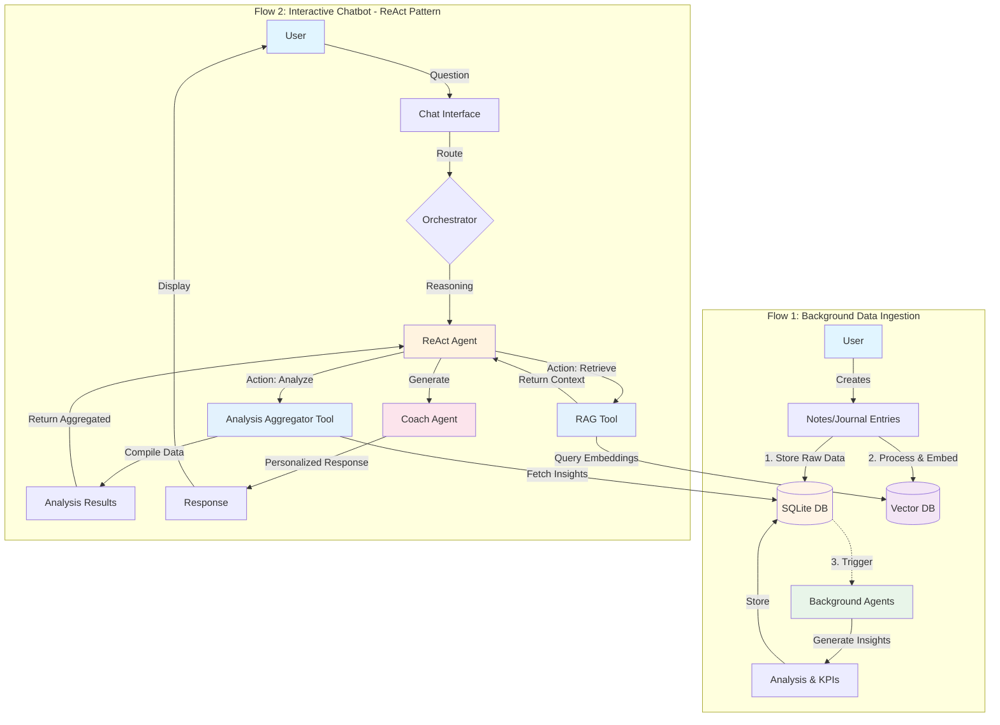

```mermaid
graph TB
    subgraph "Flow 1: Background Data Ingestion"
        U1[User] -->|Creates| Notes[Notes/Journal Entries]
        Notes -->|1. Store Raw Data| SQLite[(SQLite DB)]
        Notes -->|2. Process & Embed| VectorDB[(Vector DB)]
        SQLite -.->|3. Trigger| BG[Background Agents]
        BG -->|Generate Insights| Insights[Analysis & KPIs]
        Insights -->|Store| SQLite
    end

    subgraph "Flow 2: Interactive Chatbot - ReAct Pattern"
        U2[User] -->|Question| Chat[Chat Interface]
        Chat -->|Route| Orchestrator{Orchestrator}
        
        Orchestrator -->|Reasoning| ReAct[ReAct Agent]
        
        ReAct -->|Action: Retrieve| RAG[RAG Tool]
        RAG -->|Query Embeddings| VectorDB
        RAG -->|Return Context| ReAct
        
        ReAct -->|Action: Analyze| AggTool[Analysis Aggregator Tool]
        AggTool -->|Fetch Insights| SQLite
        AggTool -->|Compile Data| Analysis[Analysis Results]
        Analysis -->|Return Aggregated| ReAct
        
        ReAct -->|Generate| CoachAgent[Coach Agent]
        CoachAgent -->|Personalized Response| Response[Response]
        Response -->|Display| U2
    end

    style U1 fill:#e1f5ff
    style U2 fill:#e1f5ff
    style SQLite fill:#fff4e6
    style VectorDB fill:#f3e5f5
    style BG fill:#e8f5e9
    style ReAct fill:#fff3e0
    style RAG fill:#e3f2fd
    style AggTool fill:#e3f2fd
    style CoachAgent fill:#fce4ec
```