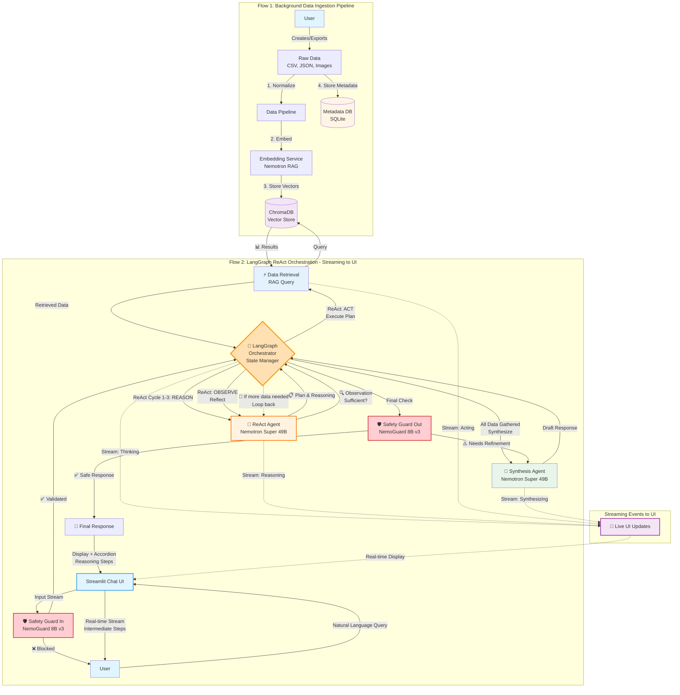

```mermaid
graph TB
    subgraph "Flow 1: Background Data Ingestion Pipeline"
        U1[User] -->|Creates/Exports| RawData[Raw Data<br/>CSV, JSON, Images]
        RawData -->|1. Normalize| Pipeline[Data Pipeline]
        Pipeline -->|2. Embed| Embedder[Embedding Service<br/>Nemotron RAG]
        Embedder -->|3. Store Vectors| VectorDB[(ChromaDB<br/>Vector Store)]
        RawData -->|4. Store Metadata| Metadata[(Metadata DB<br/>SQLite)]
    end

    subgraph "Flow 2: LangGraph ReAct Orchestration - Streaming to UI"
        U2[User] -->|Natural Language Query| Chat[Streamlit Chat UI]
        Chat -->|Input Stream| SafetyIn[🛡️ Safety Guard In<br/>NemoGuard 8B v3]
        SafetyIn -->|✅ Validated| Orch{🎯 LangGraph<br/>Orchestrator<br/>State Manager}
        SafetyIn -->|❌ Blocked| U2
        
        Orch -->|ReAct Cycle 1-3: REASON| ReActAgent[🧠 ReAct Agent<br/>Nemotron Super 49B]
        ReActAgent -->|📋 Plan & Reasoning| Orch
        
        Orch -->|ReAct: ACT<br/>Execute Plan| DataRetrieval[⚡ Data Retrieval<br/>RAG Query]
        DataRetrieval -->|Query| VectorDB
        VectorDB -->|📊 Results| DataRetrieval
        DataRetrieval -->|Retrieved Data| Orch
        
        Orch -->|ReAct: OBSERVE<br/>Reflect| ReActAgent
        ReActAgent -->|🔍 Observation<br/>Sufficient?| Orch
        
        Orch -.->|🔄 If more data needed<br/>Loop back| ReActAgent
        
        Orch -->|All Data Gathered<br/>Synthesize| Synthesis[🎨 Synthesis Agent<br/>Nemotron Super 49B]
        Synthesis -->|Draft Response| Orch
        
        Orch -->|Final Check| SafetyOut[🛡️ Safety Guard Out<br/>NemoGuard 8B v3]
        SafetyOut -->|✅ Safe Response| Response[💬 Final Response]
        SafetyOut -->|⚠️ Needs Refinement| Synthesis
        
        Response -->|Display + Accordion<br/>Reasoning Steps| Chat
        Chat -->|Real-time Stream<br/>Intermediate Steps| U2
    end

    subgraph "Streaming Events to UI"
        Orch -.->|Stream: Thinking| StreamUI[📡 Live UI Updates]
        ReActAgent -.->|Stream: Reasoning| StreamUI
        DataRetrieval -.->|Stream: Acting| StreamUI
        Synthesis -.->|Stream: Synthesizing| StreamUI
        StreamUI -.->|Real-time Display| Chat
    end

    style U1 fill:#e1f5ff
    style U2 fill:#e1f5ff
    style VectorDB fill:#f3e5f5
    style Metadata fill:#fff4e6
    style Orch fill:#ffe0b2,stroke:#ff9800,stroke-width:3px
    style ReActAgent fill:#fff3e0,stroke:#ff6f00,stroke-width:2px
    style DataRetrieval fill:#e3f2fd
    style Synthesis fill:#e8f5e9
    style SafetyIn fill:#ffcdd2,stroke:#d32f2f,stroke-width:2px
    style SafetyOut fill:#ffcdd2,stroke:#d32f2f,stroke-width:2px
    style StreamUI fill:#f3e5f5,stroke:#9c27b0,stroke-width:2px
    style Chat fill:#e1f5ff,stroke:#2196f3,stroke-width:2px
```